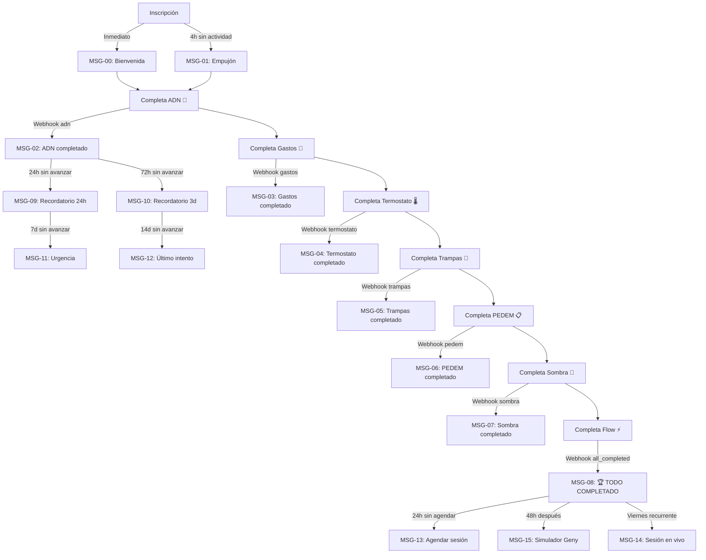

# 📱 Estrategia de Seguimiento por WhatsApp — GENY LAB

> **Objetivo:** Llevar al 100% de los usuarios a completar las 7 actividades core para desbloquear la Sesión Diagnóstico 1-a-1 (valorada en $1,000 USD).

---

## Arquitectura Técnica

### Triggers Disponibles (Webhooks)

| Evento Webhook | Cuándo se dispara | Payload clave |
|---|---|---|
| `adn` | Al completar ADN Financiero | `user.name`, `user.email`, `metadata.adn` (arquetipo) |
| `gastos` | Al completar Gastos Hormiga | `user.name`, `user.email`, `metadata.total` (fuga mensual) |
| `termostato` | Al completar Termostato Financiero | `user.name`, `user.email`, `metadata.puntaje_global` |
| `trampas` | Al completar Trampas del Dinero | `user.name`, `user.email`, `metadata.responses` |
| `pedem` | Al completar Mi Primer PEDEM | `user.name`, `user.email` |
| `sombra` | Al completar Mis Emociones | `user.name`, `user.email` |
| `flow` | Al completar Reto del Flow | `user.name`, `user.email` |
| `all_completed` | Al completar las 7 actividades | `user.name`, `user.email`, `results_url` |

### Variables Dinámicas para Plantillas

En LeadConnector/GHL, las variables del webhook se mapean así:
- `{{contact.first_name}}` → Nombre del usuario
- `{{webhook.metadata.adn}}` → Arquetipo (solo en evento `adn`)
- `{{webhook.metadata.total}}` → Fuga mensual (solo en evento `gastos`)
- `{{webhook.metadata.puntaje_global}}` → Puntaje termostato
- `{{webhook.results_url}}` → URL de resultados consolidados

> [!IMPORTANT]
> Verifica el mapeo exacto de variables en tu CRM. Los nombres pueden variar según cómo configures el webhook receiver en GHL/LeadConnector.

---

## Fase 0: Bienvenida (Trigger: Inscripción / Primer Login)

### MSG-00 · Bienvenida Inmediata
**Trigger:** Al inscribirse o hacer primer login  
**Delay:** Inmediato  
**Tipo plantilla:** Utilidad (confirmation)

```
¡Bienvenid@ a GENY LAB, {{contact.first_name}}! 🧬

Tu acceso al Reto ya está activo.

Esto es lo que te espera:
→ 7 actividades interactivas
→ Tu Radiografía Financiera completa
→ 1 Sesión Diagnóstico privada 1-a-1 (valor $1,000 USD) — GRATIS al completar todo

⚡ Tu primera misión ya te está esperando.

👉 https://genylab.ingresarios.net/app

No lo dejes para después. El 95% nunca empieza.
Tú ya estás aquí. Eso dice mucho.
```

---

### MSG-01 · Empujón a las 4 horas (si no ha iniciado)
**Trigger:** 4 horas después de inscripción, SI no ha completado ninguna actividad  
**Tipo plantilla:** Marketing

```
{{contact.first_name}}, tu Reto ya está listo y no has empezado 👀

La primera actividad toma menos de 5 minutos y te va a revelar algo que la mayoría de traders ignora sobre sí mismos.

🧬 Descubre tu ADN Financiero →
https://genylab.ingresarios.net/app

(Recuerda: al completar las 7 actividades desbloqueas tu Sesión Diagnóstico privada de $1,000 USD — incluida GRATIS en tu acceso)
```

---

## Fase 1: Progreso por Actividad (Trigger: Webhook de cada actividad)

> [!TIP]
> Cada mensaje de esta fase se envía automáticamente cuando el usuario completa una actividad. El tono es de celebración + anticipación por la siguiente.

---

### MSG-02 · Actividad 1 completada: ADN Financiero 🧬
**Trigger:** Webhook evento `adn`  
**Delay:** 2 minutos después del webhook  
**Tipo plantilla:** Utilidad

```
🧬 Tu ADN Financiero ha sido revelado, {{contact.first_name}}.

Tu arquetipo: {{webhook.metadata.adn}}

Este perfil define cómo tomas decisiones con el dinero, qué te motiva y qué te frena. Guárdalo bien — lo vamos a usar en tu Sesión Diagnóstico.

⏭️ Siguiente misión: Gastos Hormiga 🐜
Descubre cuánto dinero estás perdiendo al año sin darte cuenta.

👉 https://genylab.ingresarios.net/app

Progreso: ██░░░░░ 1/7
```

---

### MSG-03 · Actividad 2 completada: Gastos Hormiga 🐜
**Trigger:** Webhook evento `gastos`  
**Delay:** 2 minutos  
**Tipo plantilla:** Utilidad

```
🐜 Actividad completada: Gastos Hormiga

{{contact.first_name}}, acabas de descubrir que estás perdiendo ${{webhook.metadata.total}} al mes en fugas invisibles.

Eso es más de ${{webhook.metadata.total * 12}} al año que podrías estar invirtiendo.

La buena noticia: ahora lo sabes. Y saber es el primer paso para corregir.

⏭️ Siguiente: Termostato Financiero 🌡️
¿Cuál es tu techo invisible de riqueza?

👉 https://genylab.ingresarios.net/app

Progreso: ████░░░ 2/7
```

> [!NOTE]
> Si tu CRM no puede hacer operaciones matemáticas en la plantilla (`total * 12`), pre-calcula el valor anual en el webhook o simplemente omite esa línea y usa: "Eso es dinero que podrías estar invirtiendo cada año."

---

### MSG-04 · Actividad 3 completada: Termostato Financiero 🌡️
**Trigger:** Webhook evento `termostato`  
**Delay:** 2 minutos  
**Tipo plantilla:** Utilidad

```
🌡️ Tu Termostato Financiero: {{webhook.metadata.puntaje_global}}°

{{contact.first_name}}, este número define el techo invisible que tu mente le pone a tus ingresos.

El termostato se puede recalibrar. Pero primero hay que verlo.

Ya llevas 3 de 7 actividades. Estás en la mitad del camino.

⏭️ Siguiente: Trampas del Dinero 🧠
5 sesgos cognitivos que te cuestan dinero sin que lo notes.

👉 https://genylab.ingresarios.net/app

Progreso: █████░░ 3/7 — ¡Mitad del camino!
```

---

### MSG-05 · Actividad 4 completada: Trampas del Dinero 🧠
**Trigger:** Webhook evento `trampas`  
**Delay:** 2 minutos  
**Tipo plantilla:** Utilidad

```
🧠 Trampas del Dinero — completado.

{{contact.first_name}}, ya identificaste los sesgos que sabotean tus decisiones financieras.

La mayoría de los traders operan en piloto automático sin saber que su cerebro los engaña. Tú ya no.

Ahora entramos a la Fase 2: Dominio. Aquí es donde se separa el 5% del resto.

⏭️ Siguiente: Mi Primer PEDEM 📋
El framework de planificación que usan los traders consistentes.

👉 https://genylab.ingresarios.net/app

Progreso: ██████░ 4/7
```

---

### MSG-06 · Actividad 5 completada: Mi Primer PEDEM 📋
**Trigger:** Webhook evento `pedem`  
**Delay:** 2 minutos  
**Tipo plantilla:** Utilidad

```
📋 PEDEM construido.

{{contact.first_name}}, acabas de crear tu Plan Estratégico de Dinero personal.

Metas, deudas priorizadas, ingresos/egresos y plan de acción — todo estructurado.

Ya tienes más claridad financiera que el 95% de las personas.

⏭️ Siguiente: Mis Emociones 🤯
El mayor obstáculo entre tú y la consistencia no es la estrategia — son tus emociones.

👉 https://genylab.ingresarios.net/app

Progreso: ███████ 5/7 — ¡Casi llegas!
```

---

### MSG-07 · Actividad 6 completada: Mis Emociones 🤯
**Trigger:** Webhook evento `sombra`  
**Delay:** 2 minutos  
**Tipo plantilla:** Utilidad

```
🤯 Tu Sombra Financiera ha sido revelada.

{{contact.first_name}}, enfrentaste lo que la mayoría evita: tus patrones emocionales con el dinero.

Detectar tus disparadores es la diferencia entre operar desde el miedo o desde la claridad.

⏭️ ÚLTIMA MISIÓN: Reto del Flow ⚡
El estado mental donde todo fluye.

Completar esta actividad desbloquea tu Sesión Diagnóstico privada 1-a-1 (valor $1,000 USD).

👉 https://genylab.ingresarios.net/app

Progreso: ████████ 6/7 — ¡UNA MÁS!
```

---

### MSG-08 · Actividad 7 completada: Reto del Flow ⚡ (= ALL COMPLETED)
**Trigger:** Webhook evento `all_completed`  
**Delay:** 1 minuto  
**Tipo plantilla:** Utilidad

```
🏆 ¡LO LOGRASTE, {{contact.first_name}}!

Has completado las 7 actividades del Reto GENY LAB.

Eres parte del 5% de los traders que realmente hacen el trabajo.

🎁 Tu recompensa está desbloqueada:
→ Sesión Diagnóstico privada 1-a-1
→ Valor: $1,000 USD — INCLUIDA GRATIS
→ Análisis de tu ADN financiero, métricas y patrones emocionales
→ Plan de acción personalizado

📅 AGÉNDALA AHORA antes de que se llenen los espacios:
👉 https://genylab.ingresarios.net/app/diagnostico

No lo dejes para después. Los espacios son limitados.
```

---

## Fase 2: Recordatorios de Inactividad

> [!IMPORTANT]
> Estos mensajes se envían si el usuario NO avanza. Configúralos como condicionales en tu CRM: se ejecutan solo si el usuario no ha completado la siguiente actividad después de X tiempo.

---

### MSG-09 · 24 horas sin avanzar (después de cualquier actividad)
**Trigger:** 24 horas después de la última actividad completada, SI no ha completado la siguiente  
**Tipo plantilla:** Marketing

```
{{contact.first_name}}, ayer le diste duro al Reto y avanzaste increíble 💪

Hoy tu siguiente actividad te está esperando. Son menos de 10 minutos.

Recuerda: al completar las 7 actividades desbloqueas tu Sesión Diagnóstico privada de $1,000 USD.

👉 https://genylab.ingresarios.net/app

El momentum importa. No lo pierdas.
```

---

### MSG-10 · 3 días sin avanzar
**Trigger:** 72 horas de inactividad  
**Tipo plantilla:** Marketing

```
{{contact.first_name}}, llevas 3 días sin entrar al Reto 👀

Entiendo que la vida pasa. Pero cada día que no avanzas, el 95% gana.

Tu progreso está guardado. No tienes que empezar de cero.

La siguiente actividad toma menos de 10 minutos.

👉 https://genylab.ingresarios.net/app

¿Qué le dirías a tu yo del futuro si hoy decides no continuar?
```

---

### MSG-11 · 7 días sin avanzar (urgencia)
**Trigger:** 7 días de inactividad  
**Tipo plantilla:** Marketing

```
{{contact.first_name}}, hace una semana que no entras al Reto.

Voy a ser directo:

La Sesión Diagnóstico 1-a-1 (valor $1,000 USD) está incluida GRATIS en tu acceso. Pero solo la desbloqueas al completar las 7 actividades.

La mayoría de los traders nunca llegan. No porque sea difícil, sino porque lo posponen.

Tu progreso sigue ahí. Solo necesitas 30 minutos para terminar todo.

👉 https://genylab.ingresarios.net/app

¿Vas a dejar pasar esto?
```

---

### MSG-12 · 14 días sin avanzar (último intento)
**Trigger:** 14 días de inactividad  
**Tipo plantilla:** Marketing

```
{{contact.first_name}}, este es mi último mensaje sobre el Reto.

Tienes acceso a una herramienta que reveló tu ADN financiero, tus fugas de dinero, tus patrones emocionales y tu termostato de riqueza.

Y al final del camino, una Sesión Diagnóstico privada 1-a-1 valorada en $1,000 USD. Incluida. Gratis.

Solo tienes que terminar.

👉 https://genylab.ingresarios.net/app

Si decides no continuar, lo respeto. Pero no quiero que sea porque se te olvidó.
```

---

## Fase 3: Post-Completado (Retención y Engagement)

---

### MSG-13 · Recordatorio de agendar sesión (si no agenda en 24h)
**Trigger:** 24h después del `all_completed`, SI no ha agendado  
**Tipo plantilla:** Utilidad

```
{{contact.first_name}}, completaste las 7 actividades pero aún no has agendado tu Sesión Diagnóstico 🏆

Los espacios se llenan rápido. Asegura el tuyo:

📅 https://genylab.ingresarios.net/app/diagnostico

En esta sesión un experto analiza tu radiografía completa y te da un plan de acción personalizado. Es como tener un estratega financiero privado por 45 minutos.

No dejes pasar esto.
```

---

### MSG-14 · Recordatorio de sesión en vivo (sábados)
**Trigger:** Viernes por la tarde (recurrente semanal)  
**Tipo plantilla:** Marketing

```
{{contact.first_name}}, mañana sábado a las 11am (hora Colombia) tenemos Sesión en Vivo 🔴

Es tu espacio para resolver dudas, revisar métricas y calibrar tu termostato financiero en grupo.

🔗 Únete aquí: https://us02web.zoom.us/j/87949998005?pwd=czy7Zz12DNJTwUSssfDgt8yatSrkGl.1

🔑 Si te pide clave: 612978

Te esperamos.
```

---

### MSG-15 · Invitación al Simulador Geny Opciones
**Trigger:** 48h después del `all_completed`  
**Tipo plantilla:** Marketing

```
{{contact.first_name}}, ya desbloqueaste tu Sesión Diagnóstico.

¿Quieres ir un paso más allá?

En la sección "Geny Opciones" tienes un simulador de opciones financieras con:
→ 11 lecciones paso a paso
→ Cadena de opciones en tiempo real
→ Coach con IA que te guía
→ Misiones y XP para medir tu progreso

Es como tener un mercado de práctica en tu bolsillo.

👉 https://genylab.ingresarios.net/app/geny-opciones

100% seguro. $0 de riesgo real. Todo el aprendizaje.
```

---

## Resumen de Flujo Completo



---

## Configuración en LeadConnector / GHL

### Paso 1: Configurar Webhook Receiver
1. En GHL → **Settings → Webhooks**, crea un webhook que reciba de `https://tfwvvsvoimgnwjodfwlh.supabase.co/functions/v1/activity-completed`.
2. Ya está configurado en el Admin Panel de GENY LAB (sección Webhooks). Asegúrate de que el webhook de LeadConnector esté suscrito a los eventos: `adn`, `gastos`, `termostato`, `trampas`, `pedem`, `sombra`, `flow`, `all_completed`.

### Paso 2: Crear Workflow por cada mensaje
- Cada MSG se convierte en un **Workflow** en GHL.
- **Trigger del workflow:** Webhook Received → filtrar por `event` (ej: `event = "adn"`).
- **Action:** Send WhatsApp Message → usar la plantilla correspondiente.

### Paso 3: Mensajes de Inactividad
- Crear workflows con **Wait + Condition**:
  - Wait 24h → Check si el contacto tiene tag `actividad_X_completada` → Si NO → Enviar MSG-09.
  - Repetir lógica para 3d, 7d, 14d.

### Paso 4: Tags recomendados
Cada vez que se reciba un webhook de actividad completada, agregar un tag al contacto:
- `reto_adn_completado`
- `reto_gastos_completado`
- `reto_termostato_completado`
- `reto_trampas_completado`
- `reto_pedem_completado`
- `reto_sombra_completado`
- `reto_flow_completado`
- `reto_all_completed` ← este es el más importante

Esto permite crear segmentos y condicionales precisos.

---

## Notas de Implementación

> [!WARNING]
> **Límites de WhatsApp Business API:**
> - Las plantillas de tipo **Utilidad** (transaccionales) se pueden enviar sin restricción de opt-in previo — úsalas para los mensajes de progreso (MSG-02 a MSG-08).
> - Las plantillas de tipo **Marketing** requieren opt-in y están sujetas a límites de frecuencia — úsalas para recordatorios de inactividad y sesiones en vivo.
> - WhatsApp permite máximo **1 mensaje de marketing cada 24 horas** por contacto.

> [!TIP]
> **Personalización con datos reales:**
> Los mensajes MSG-02 (arquetipo), MSG-03 (fuga mensual) y MSG-04 (puntaje termostato) usan datos reales del webhook. Esto genera un efecto "wow" porque el usuario siente que el mensaje fue creado específicamente para él. Es el detalle que más engagement genera.
